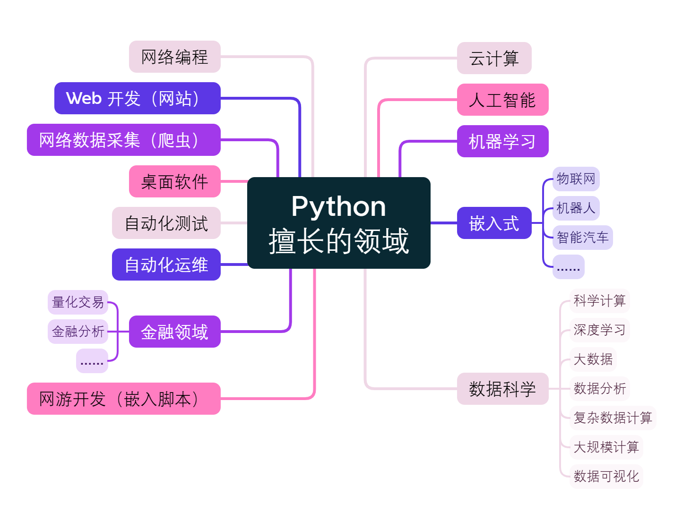

# Python 简介

`Python` 是一门易于学习、功能强大的编程语言。它提供了高效的高级数据结构，还能简单有效地面向对象编程。`Python` 优雅的语法和动态类型以及解释型语言的本质，使它成为多数平台上写脚本和快速开发应用的理想语言。[[1]](https://docs.python.org/zh-cn/3/tutorial/index.html)

如果您的工作主要是用电脑完成的，总有一天您会想能不能自动执行一些任务。比如，对大量文本文件执行查找、替换操作；利用复杂的规则重命名、重排序一堆照片文件；也可能您想编写一个小型数据库、或开发专用的图形界面应用，甚至是开发一个简单的游戏。

作为一名专业软件开发人员，您可能要处理 C/C++/Java 库，但编码、编译、测试、再编译这些开发流程太慢了；也许您正在给这些库开发测试套件，但总觉得这项工作真是枯燥乏味。又或许，您开发了个使用扩展语言的软件，却不想为这个软件专门设计一种新语言。

那么，Python 正好能满足您的需要。[[2]](https://docs.python.org/zh-cn/3/tutorial/appetite.html)

## Python 的特点

- **`简单易学`** `Python` 的定位是“`优雅`”、“`明确`”、“`简洁`”，所以 Python 程序看上去总是简单易懂，它能够让你专注于问题的解决方法，而不是语言本身。初学者学 Python，不但入门容易，而且将来深入下去，可以编写那些非常复杂的程序。
- **`开源免费`** [`Python` 官网](https://www.python.org/)上免费提供了 `Python` 解释器和扩展的标准库，包括源码和适用于各操作系统的机器码形式，并可自由地分发。
- **`可移植（跨平台）`** 你写的 `Python` 程序可以在 Linux, Windows, Mac, BSD 等几乎所有的的操作系统上运行！
- **`解释性`** `Python` 程序不需要编译就能执行。
- **`面向对象`** `Python` 既支持`面向过程`的编程，又支持`面向对象`的编程。
- **`高阶语言`** 当写 `Python` 程序的时候，你无需考虑诸如如何管理你的程序使用的内存一类的底层细节。
- **`可扩展`** 你可以使用 `C` 或者 `C++` 编写程序 `Python` 扩展，然后从 `Python` 程序中使用它。
- **`可嵌入`** 你可以将 `Python` 嵌入到你的 `C/C++` 程序中，为程序的用户提供 `脚本` 功能。
- **`丰富的库`** `Python` 标准库提供包括正则表达式、文档生成、单元测试、线程、数据库、网页浏览器、CGI、FTP、电子邮件、XML、XML-RPC、HTML、WAV 文件、加密、GUI（图形用户界面）以及其它系统相关的东西。除了标准库以外，你还可以在 `Python` `包索引` 中找到其它各种高质量的库。
- **`规范的代码`** `Python` 采用强制缩进的方式使得代码具有极佳的可读性。

## Python 擅长的领域

简单的语法、广泛的用途，特别是人工智能、大数据的发展更起到推波助澜的作用，让 `Python` 近年来越来越热。

## Python 不能做什么

Python 当然也有不能干的事情，比如：

- 写操作系统，主要用 `C` 语言写；
- 写 `iOS` 应用，只能用 `Swift/Objective-C`
- 写 `Android` 应用，主要用 `Java`；
- 写桌面 `3D` 游戏，最好用 `C` 或 `C++`。
