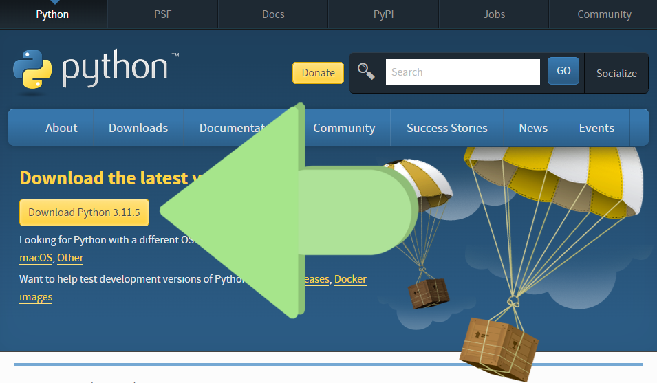
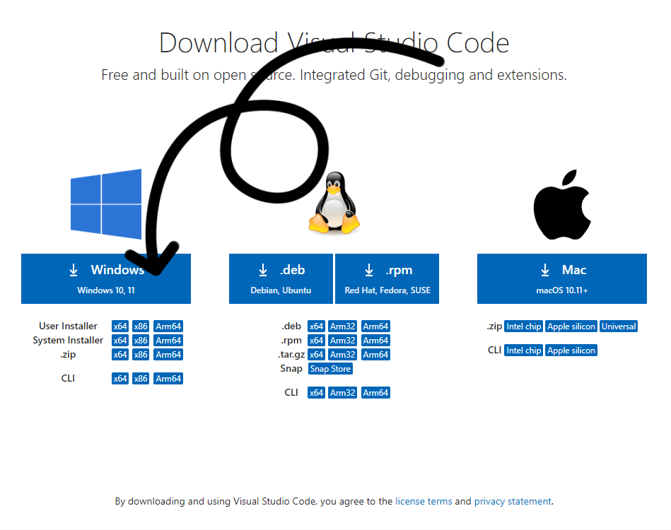
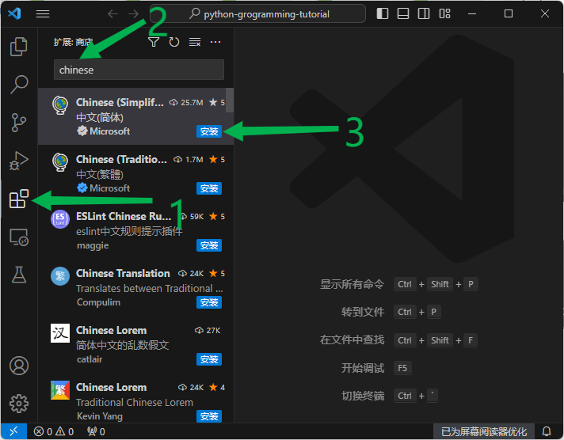
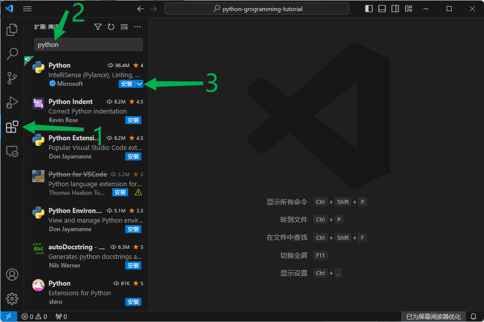

# 安装 Python 解释器及编辑器

## 一、安装 Python

除 `Windows` 外，一般的操作系统都自带 `Python`，但版本一般都比较老。作为新的学习者建议使用 Python 3.8 及以上的版本，不建议使用已经停止维护的版本（目前最新正式版为 `3.12`，[查看 Python 版本生命周期](https://devguide.python.org/versions/#supported-versions)）。

### 1. Windows 安装 Python

#### 通过 Microsoft Store 安装

（Windows 10/11 推荐用此安装方式）

打开 `Microsoft Store`，搜索 `Python`，安装最新版或根据你需要的版本安装就可以。

#### Windows 下载安装包安装



打开 [Python 官网的下载页面](https://www.python.org/downloads/)，点击下载按钮，下载 Python 安装包，下完双击运行后，一直点下一步就行。

### 2. Mac 安装 Python

#### 用 brew 安装

运行下面命令即可安装 Python。

```sh
brew install python3
```

#### Mac 下载安装包安装

打开 [Python 官网的下载页面](https://www.python.org/downloads/)，点击下载按钮，下载 Python 安装包，下完双击运行后，一直点下一步就行。

### 3. Ubuntu/Debian 安装

运行下面命令即可安装 Python。

```sh
sudo apt install python
```

### 4. Redhat/CentOS 安装

运行下面命令即可安装 Python。

```sh
sudo yum -y install python
```


## 二、安装 VSCode

`VSCode`（Visual Studio Code）是一个跨平台、开源免费的代码编辑器，非常适合用来编写 Python 程序。
`PyCharm` 是当前最优秀的 Python IDE（集成开发环境），写 Python 程序推荐首先的 IDE，但它是收费的。

### 1. 下载安装 VSCode

[打开官方下载网址](https://code.visualstudio.com/download)



选择对应你的系统点击下载，下载完成后双击安装即可。

> 如果你用的是 Windows 系统，也可以通过 `Microsoft Store` 安装，打开 `Microsoft Store` 搜索 `vscode`，点击安装即可，比下载安装快很多。

### 2. 安装 VSCode 中文语言包



安装好 `VSCode` 启动后，默认是英文版界面，如果英语用不惯，可以安装中文语言包。如图所示，点击左边的 `扩展` 图标，搜索 `Chinese Simplified`，点击“安装”，即可装好，你的 VSCode 界面就显示为中文了。

### 3. 安装 Python 插件



点击左边的 `扩展` 图标，搜索 `python`，点击“安装”，这样就安装好 VSCode python 扩展了。


这样编写 python 代码的时候，右上角就出现一个“运行”图标，点击即可运行当前编辑的代码文件。


## 注：

- 还可以通过 `conda` 安装 Python，[查看文档](https://docs.conda.io/projects/miniconda/en/latest/)