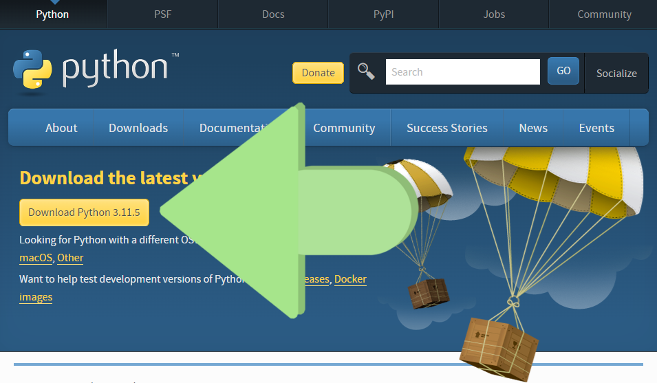

# 安装 Python

除 `Windows` 外，一般的操作系统都自带 `Python`，但版本一般都比较老。作为新的学习者建议使用 Python 3.8 及以上的版本，不建议使用已经停止维护的版本（目前最新正式版为 `3.12`，[查看 Python 版本生命周期](https://devguide.python.org/versions/#supported-versions)）。

## 1. Windows 安装 Python

### 通过 Microsoft Store 安装

（推荐用此安装方式）

方法一、打开 `Microsoft Store` 搜索 `Python`，安装最新版或根据你需要的版本安装就可以。

方法二、如果你用的是 Windows 10/11，在终端输入 `python`，如果你的系统还没有安装 Python，就会自动弹出 Microsoft Store Python 最新版的页面，点击“获取”按钮即可安装。

### Windows 下载安装包安装



打开 [Python 官网的下载页面](https://www.python.org/downloads/)，点击下载按钮，下载 Python 安装包，下完双击运行后，一直点下一步就行。

## 2. Mac 安装 Python

### 用 brew 安装

运行下面命令即可安装 Python。

```sh
brew install python3
```

### Mac 下载安装包安装

打开 [Python 官网的下载页面](https://www.python.org/downloads/)，点击下载按钮，下载 Python 安装包，下完双击运行后，一直点下一步就行。

## 3. Ubuntu/Debian 安装

运行下面命令即可安装 Python。

```sh
sudo apt install python
```

## 4. Redhat/CentOS 安装

运行下面命令即可安装 Python。

```sh
sudo yum -y install python
```
