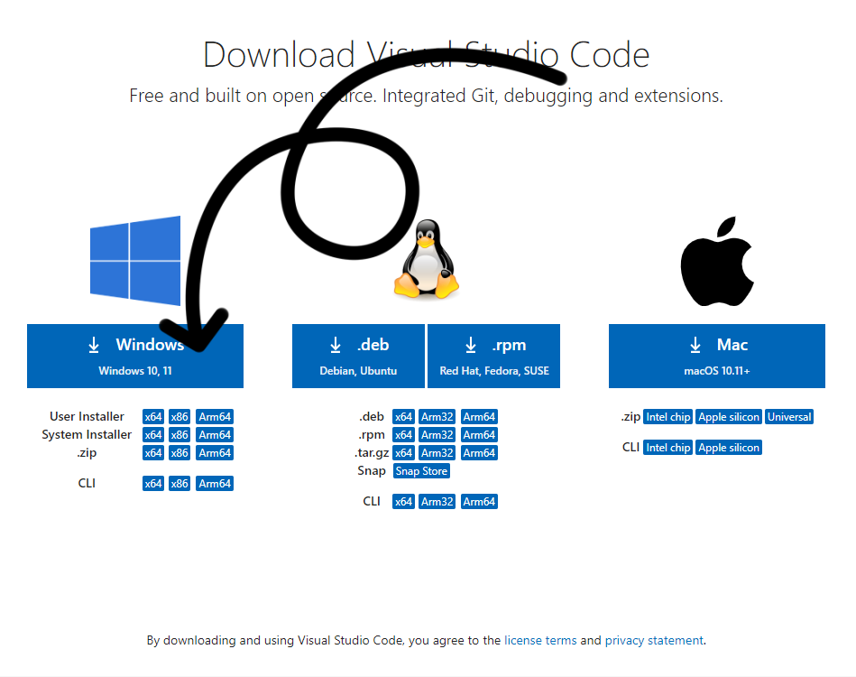
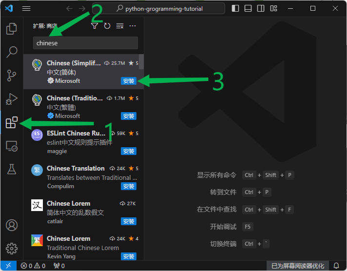
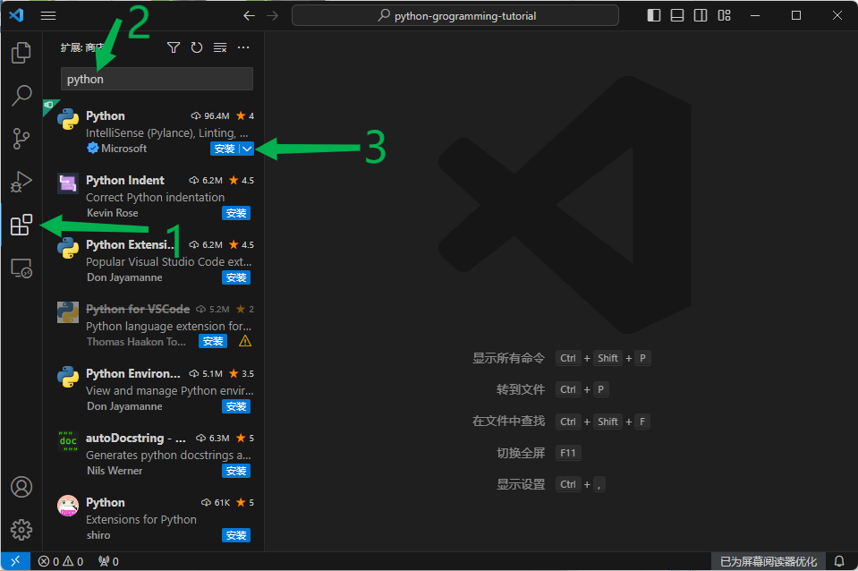

# 安装 VSCode

`VSCode`（Visual Studio Code）是一个跨平台、开源免费的代码编辑器，非常适合用来编写 Python 程序。
`PyCharm` 是当前最优秀的 Python IDE（集成开发环境），写 Python 程序推荐首先的 IDE，但它是收费的。

## 1. 下载安装 VSCode

[打开官方下载网址](https://code.visualstudio.com/download)

选择对应你的系统点击下载，下载完成后双击安装即可。

> 如果你用的是 Windows 系统，也可以通过 `Microsoft Store` 安装，打开 `Microsoft Store` 搜索 `vscode`，点击安装即可，比下载安装快很多。

## 2. 安装 VSCode 中文语言包

安装好 `VSCode` 启动后，默认是英文版界面，如果英语用不惯，可以安装中文语言包。如图所示，点击左边的 `扩展` 图标，搜索 `Chinese Simplified`，点击“安装”，即可装好，你的 VSCode 界面就显示为中文了。

## 3. 安装 Python 插件

点击左边的 `扩展` 图标，搜索 `python`，点击“安装”，这样就安装好 VSCode python 扩展了。

这样编写 python 代码的时候，右上角就出现一个“运行”图标，点击即可运行当前编辑的代码文件。
