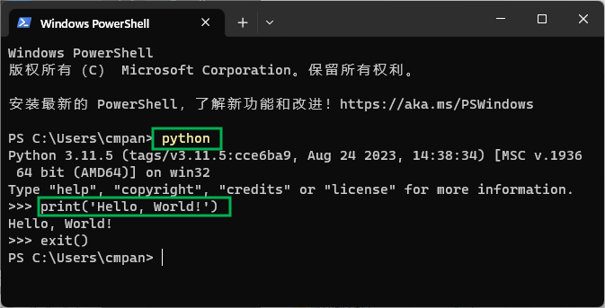

# 初识 Python 编程

## 1. 什么是程序

`程序` 指定运算的一组指令。运算可以是数学计算, 如加减乘除；也可以是符号运算, 例如检索或者替换文档中的语句词汇；也可以是图形运算，比如处理图片、播放视频。[[1]](https://greenteapress.com/thinkpython2/html/thinkpython2002.html#sec6)

不同语言虽各有特色, 但基础指令相差无几:

- 输入: 从键盘, 文件, 网络或者其他设备中获取数据；
- 输出: 将数据显示于屏幕, 保存至文件, 通过网络发送等；
- 数学计算: 加减乘除等数学运算；
- 条件选择: 检查条件并运行相应的代码；
- 循环执行: 重复执行, 直到达到退出条件。

基础指令不过这些，不管是哪种编程语言, 也无论何等复杂, 都由类似指令构成。

`编程` 便是将庞大复杂的任务不断分解细化, 直至细化为这些基础指令，然后用代码表现（写）出来。

## 2. 初识 Python 程序

通常, 学习一门新的编程语言, 写的第一个程序就是"Hello, World!". 在 Python 中这样编写:

```python
print('Hello, World!')
```

这段程序意思是把 `Hello, World!` 显示在屏幕上。


如上图所示，打开 `终端`，输入 `python`， 然后按 `enter` 键；  
接着输入 `print('Hello, World!')` 后，再按 `enter` 键；  
将会显示 `Hello, World!`。

这是学习的时候运行 Python 代码的一种方式，下一节详细介绍 Python 程序的各种运行方式。
