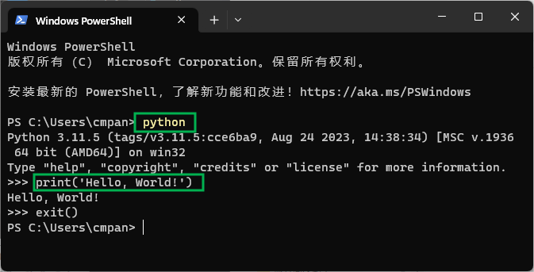
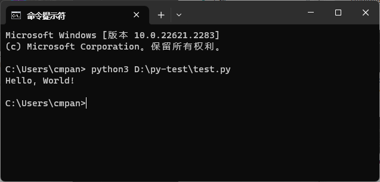
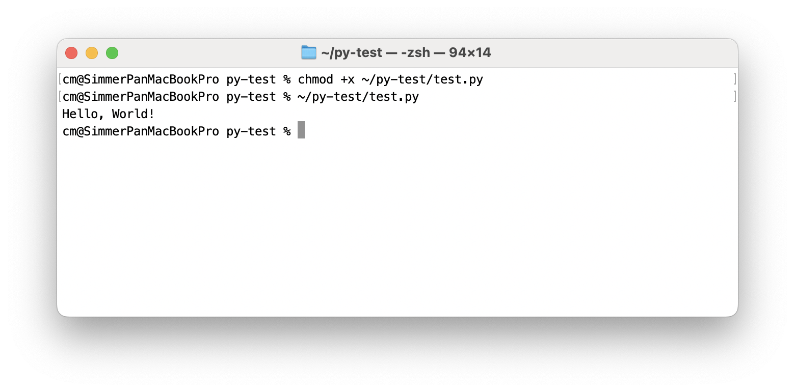
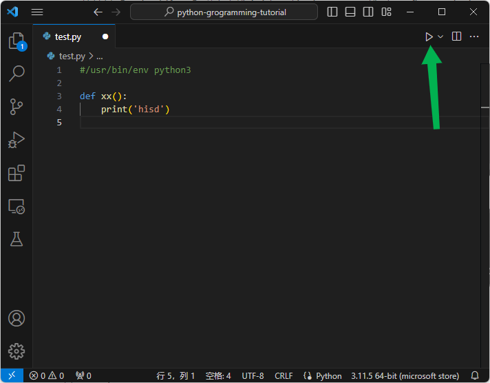

# 运行 Python 程序

运行 `Python` 代码的程序叫做 `Python` 解释器，就是我们在前面安装的 `Python`。

> Python 解释器有两个版本, 分别是 `Python 2` 和 `Python 3`, 它们及其相似,两者稍有差异, 初学时需要关注。本教程主要面向 `Python 3`, 掌握了 `Python 3` 后，你可以再[阅读官方文档了解 怎样实现 Python 2/3 兼容性](https://docs.python.org/zh-cn/3/howto/pyporting.html)。

## 1 交互模式

在 Python 解释器的交互模式下，可以直接运行 Python 语句。



操作步骤：

1、打开 Windows 菜单，搜索 `命令提示符`（也可以是终端或 Power Shell），点击打开；  
2、输入 `python3` 启动 Python 交互模式；  
3、输入代码 `print('Hello, World!')`，然后敲回车键；  
4、将显示 `Hello, World!`  
5、可以继续接着输入执行 Python 代码指令。  
6、输入 `quit()` 或 `exit()` 退出 Python 交互模式窗口。

## 2 脚本模式



1、在资源管理器中打开 `D:\py-test` 文件夹；  
2、新建 `test.py` 文件；  
3、用 VSCode 打开，输入以下内容并保存：

```python
print('Hello, World!')
```

4、打开 Windows 菜单，搜索 `命令提示符`（也可以是终端或 Power Shell），点击打开；  
5、输入 `python3 D:\py-test\test.py`，这样就是运行 Python 脚本了。  
6、结果将显示 `Hello, World!`  

## 3 shebang 模式

通过 `shebang` 指定解释器，可双击 python 脚本文件运行脚本或在终端直接运行 python 脚本文件。

这种模式仅在类 Unix 系统（如Unix/Linux/Mac/BSD等）上有效，如果你的操作系统是 Windows，可以先不管这一段，可可以在 `wsl` 或虚拟机上试试。

在 Python 脚本的第一行加入注释：

```python
#!/usr/bin/env python3
```

或者

```python
#!/usr/bin/python3
```

在脚本中, 第一行以 `#!` 开头的代码, 在计算机行业中叫做 `shebang`, 也叫做 `sha-bang/hashbang/pound-bang/hash-pling`, 其作用是"指定由哪个解释器来执行脚本"。

如：

`~/py-test/test.py` 内容为：

```python
#!/usr/bin/env python3

print('Hello, World!')

```



在终端输入一下代码给脚本添加执行权限：

```sh
chmod +x ~/py-test/test.py
```

然后在终端输入 `~/py-test/test.py` 命令，就运行了该 Python 脚本。

## 4 集成开发环境运行

在 Python 的 IDE（集成开发环境）中都集成了 Python 解释器，我们只需要点击运行按钮或按键盘运行快捷键就可以运行脚本，这样运行就更方便了。这种模式本质还是以脚本模式运行，只是 IDE 帮我们完成了调用解释器运行脚本的过程。

如下图：在 vscode 中运行 python 脚本。



## 5 打包成可执行程序

我们可以借助 Python 打包工具（例如 Pyinstaller），把 Python 代码打包成可执行程序，用户只需要点击程序图标就可以启动程序，这样就能用 Python 来开发桌面应用程序了。
