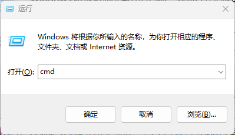

# 什么是终端

我们学习 Python 的时候，需要经常打开终端来运行 Python 代码。

`终端` 是一个应用程序，它提供一个界面，用户在其中输入命令，可执行一系列的操作，例如创建、复制、移动、删除文件，启动 python 程序，执行 Python 脚本等。

有些系统把终端称作命令行、命令提示符、控制台等。

## 1. 打开 Windows `终端` 应用程序

在 Windows 系统上，按键盘 `win + r` 键，输入 `cmd` 后，点键盘 `enter` 键，这样就打开了 Windows `终端` 应用程序。

打开 `终端`，输入 `python` 后按 `enter` 键，就可以启动 Python 交互模式来直接运行 python 代码。

另外在 Windows 10/11 下，你还可以直接打开 `终端` 或 `PowerShell` 程序来执行命令。

## 2. 打开 Mac `终端` 应用程序

打开 `启动台`， 搜索 `终端`，点击即可打开。

## 3. VSCode 终端

VSCode 以及集成了 `终端` 应用程序，我们平时用 VSCode 写程序的时候，也可以用 VSCode 的终端来运行命令。

