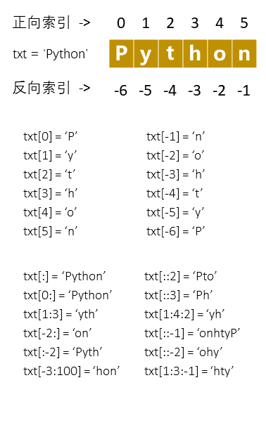

# 2.3 字符串 - str

Python 可以操作文本（由 `str` 类型表示，称为“`字符串`”）。

`字符串`是一行或多行文本内容，是文本序列类型。

## 字符串的创建

- 字符串用单引号 `'` 或双引号 `"` 括起来。
- 可以用三重引号（"""...""" 或 '''...'''）创建多行字符串（也可以用来做多行注释）。
- 用反斜杠 `\` 转义特殊字符，在字符串前面添加一个 `r` 表示原始字符串（有 `\` 将不转义）。
- 在字符串前面加一个 `f` 表示格式化字符串，字符串中可通过大括号引用变量。
- 反斜杠 (`\\`) 可以作为续行符，表示下一行是上一行的延续。

```pycon
>>> a = 'Hello' # 定义字符串变量
>>> b = "World" # 定义字符串变量
>>> name = 'LiLei'
>>> f"My name is {name}" # 格式化字符串
>>>
>>> print('Ru\noob') # \n 换行
Ru
oob
>>> print(r'Ru\noob') # r在前面
Ru\noob
>>>
# \ 作为续行符
>>> 'Hello\
... World\
... !'
'HelloWorld!'
>>>
>>> 'Hello'\
... 'World'\
... '!'
'HelloWorld!'
>>> '''
... Hello
... World'''
'\nHello\nWorld'
>>>
>>> '''\
... Hello
... World'''
'Hello\nWorld'
>>>
>>> """\
... Hello
... World"""
'Hello\nWorld'
```

## 字符串的运算

| 操作符                 | 描述                                           |
|---------------------|----------------------------------------------|
| `+`                 | 字符串连接                                        |
| `*`                 | 重复字符串                                        |
| `[]`                | 通过索引访问字符串的字符，索引可以是负数                         |
| `[start:stop]`      | 切片操作，截取字符串指定范围                               |
| `[start:stop:step]` | 切片操作，`step` 为切片间隔                            |
| `in`                | 成员运算符 - 如果字符串中包含给定的字符返回 `True`，否则返回 `False`  |
| `not in`            | 成员运算符 - 如果字符串中不包含给定的字符返回 `True`，否则返回 `False` |
| `%`                 | 格式化字符串                                       |

```pycon
>>> a = 'Hello' # 定义字符串变量
>>> b = 'World'
>>> a + b # 连接字符串
'HelloWorld'
>>> a * 3 # 字符串重复
'HelloHelloHello'
>>> a[0] # 索引访问
'H'
>>>
>>> 'He' in a
True
>>> 'He' in b
False
>>> 'He' not in b
True
```

## 字符串切片

`切片` 就是在序列对象（字符串、元组或列表）中选择某个范围内的项。 切片可被用作表达式以及赋值或 `del` 语句的目标。

Python 访问子字符串，可以使用方括号 `[]` 来截取字符串，字符串的截取的语法格式如下：

```text
变量[start:stop]
变量[start:stop:step]
```
其中参数 `start` 和 `step` 的默认值为 None。切片对象具有只读数据属性 `start` 、`stop` 和 `step`，

- start - 索引头，索引值以 `0` 为开始值，负数为从末尾开始，`-1` 为从末尾开始的开始值。
- stop - 索引尾
- step - 切片间隔，每个所少个索引值截取一个值



```pycon
>>> txt = 'Python'
>>> a[1:4] # 切片
'ytho'
>>> a[2:] # 切片省略结尾索引，表示取到末尾
'thon'
>>> a[:3] # 切片省略开始，表示从 0 开始
'Pyth'
>>> a[:-2] # 切片下标可以是负数
'Pytho'
>>> a[:100] # 索引超过则取到末尾
'Python'
>>> x = '123456789'
>>> x[1:8:2] # 指定切片间隔
'2468'
>>> x[::2] # 省略切片开始、结束下标，表示取整个字符串
'13579'
>>> x[::-2] # 间隔数为复数则是反转字符串后再按间隔截取
'97531'
>>> x[::-1]
'987654321'
>>>
```